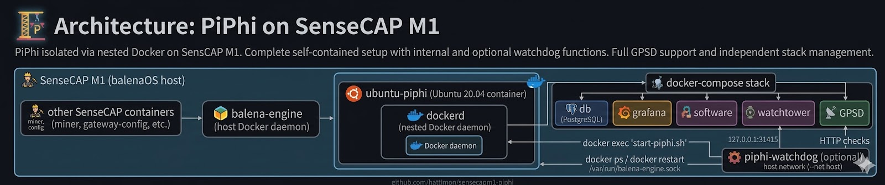
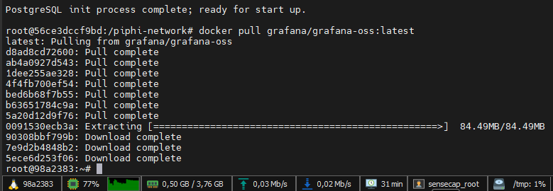
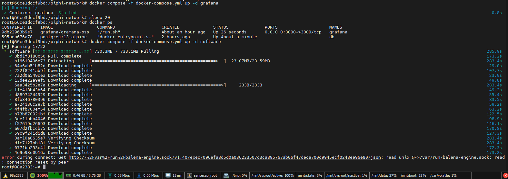
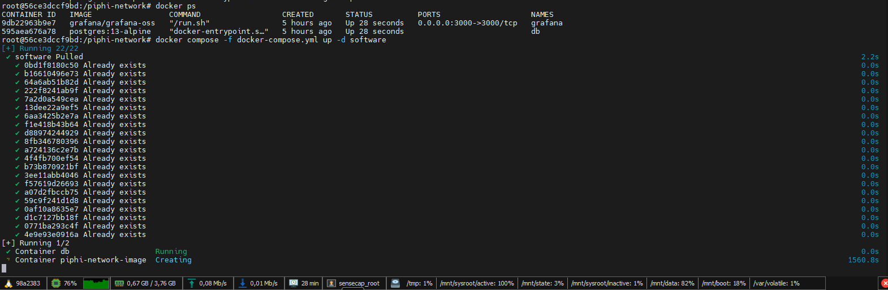
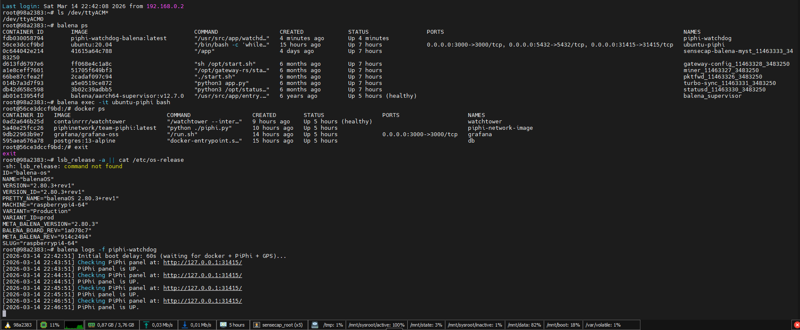

# 🛰️ PiPhi on SenseCAP M1 (balenaOS)




Run the **PiPhi network stack** on a **SenseCAP M1** device using
**balenaOS** and a **USB GPS module**.

This repository prepares a **safe PiPhi environment inside an Ubuntu
container** (`ubuntu-piphi`) and optionally allows running a **watchdog
container** that automatically recovers the PiPhi panel.

------------------------------------------------------------------------

⚠️ **Security notice / Ostrzezenie**   
Before any installation, read [SECURITY.md](SECURITY.md) for backup and flashing steps.   
Przed rozpoczeciem instalacji zapoznaj sie z [SECURITY.md](SECURITY.md) (backup i flashowanie).

------------------------------------------------------------------------

# 🌐 Language / Jezyk

- 🇬🇧 [English Documentation](#english-documentation)
- 🇵🇱 [Dokumentacja po Polsku](#dokumentacja-po-polsku)

------------------------------------------------------------------------

# 🏗 Architecture

The environment runs PiPhi **inside a nested Docker environment** to isolate it from the default SenseCAP miner stack.

```
SenseCAP M1 (balenaOS host)
    |
    |-- balena-engine (host Docker daemon)
    |       |
    |       |-- ubuntu-piphi (Ubuntu 20.04 container)
    |       |         |
    |       |         |-- dockerd (nested Docker daemon)
    |       |                   |
    |       |                   |-- PiPhi docker-compose stack
    |       |                             |-- db
    |       |                             |-- grafana
    |       |                             |-- software
    |       |                             |-- watchtower
    |       |                             |-- GPSD
    |       |
    |       |-- other SenseCAP containers (miner, gateway-config, etc.)
    |
    |-- piphi-watchdog (optional)
            |
            |-- HTTP checks on 127.0.0.1:31415 (host network, --net host)
            |-- docker ps / docker restart ubuntu-piphi (via /var/run/balena-engine.sock)
            |-- docker exec ubuntu-piphi sh -lc 'cd /piphi-network && ./start-piphi.sh'
```

------------------------------------------------------------------------

<a id="english-documentation"></a>
# 🇬🇧 English Documentation

## ⚙️ Requirements

Before installation, make sure you have:

- SenseCAP M1 device
- Minimum 64 GB SD card
- balenaOS installed and running
- Root SSH access
- USB GPS module (recommended: U-Blox 7) [VK-162 G-Mouse USB GPS]
- Internet connection

## 💡 Recommendations

If you work frequently with SenseCAP, these tools make setup and troubleshooting easier:

- MobaXterm - SSH/SCP terminal with tabbed sessions and file browser. Download: https://mobaxterm.mobatek.net/download.html
- DCC (Docker Control Center) - manage SenseCAP M1 containers from a GUI. Repo: https://github.com/hattimon/DCC
- SSH Key Forge - create, upload, and manage SSH keys remotely. Repo: https://github.com/hattimon/ssh-key-forge

------------------------------------------------------------------------

## 🔐 SSH Root Access

Full guide:

https://github.com/hattimon/miner_watchdog/blob/main/linki.md#jak-dosta%C4%87-si%C4%99-na-root-sensecap-m1-przez-ssh

------------------------------------------------------------------------

## 📡 Check GPS Device

On SenseCAP host:

```bash
ls /dev/ttyACM*
```

Expected:

    /dev/ttyACM0

------------------------------------------------------------------------

## 🧭 Basic Navigation

Enter Ubuntu container:

```bash
balena exec -it ubuntu-piphi bash
```

Check containers:

```bash
docker ps
```

Exit container:

```bash
exit
```

Check host containers:

```bash
balena ps
```

Identify environment:

```bash
lsb_release -a || cat /etc/os-release
```

------------------------------------------------------------------------

## 🚀 Install PiPhi

```bash
mkdir -p /mnt/data/piphi
cd /mnt/data/piphi

curl -L https://raw.githubusercontent.com/hattimon/sensecapm1-piphi/main/install-piphi-sensecapm1.sh -o install-piphi-sensecapm1.sh
chmod +x install-piphi-sensecapm1.sh

./install-piphi-sensecapm1.sh
```

------------------------------------------------------------------------

## 🐳 First Manual Start

Enter container:

```bash
balena exec -it ubuntu-piphi bash
cd /piphi-network
```

Start Docker daemon:

```bash
dockerd --host=unix:///var/run/docker.sock > /piphi-network/dockerd.log 2>&1 &
sleep 10
docker ps
```

------------------------------------------------------------------------

## 🧩 Manual Start Stages

Stage 1:

```bash
docker compose -f docker-compose.yml up -d db
sleep 20
```

Stage 2:

```bash
docker compose -f docker-compose.yml up -d grafana
sleep 20
```

Stage 3:

```bash
docker compose -f docker-compose.yml up -d software
sleep 20
```

Stage 4:

```bash
docker compose -f docker-compose.yml up -d watchtower
```

------------------------------------------------------------------------

## 🛠 Troubleshooting / Real Installation Example

### Example 1 - Docker pulling images



During large image pulls Docker may appear to stop or return to the shell. In reality the **extraction continues in the background**.

Wait until **CPU drops to ~5% and stays stable for 2-3 minutes**.

After most of these stages a **device reboot was required**.

------------------------------------------------------------------------

### Example 2 - Layers already downloaded



Messages like:

    Already exists

mean Docker already downloaded these layers earlier.

Docker will reuse them and continue creating containers.

If you see:

    error during connect: ... connection reset by peer

The pull often continues in the background. This is the longest image and may require multiple restarts.
Only reboot after CPU drops to ~5% and stays stable for 2-3 minutes.

------------------------------------------------------------------------

### Example 3 - Final container creation



After several restarts the **software container finally started correctly**.

At this point running:

```bash
docker compose -f docker-compose.yml up -d watchtower
```

works immediately because **watchtower** is a small image and pulls quickly.

------------------------------------------------------------------------

### Example 4 - Post-install checks and watchdog logs



This screen shows a healthy post-install state:

- /dev/ttyACM0 is present (GPS detected).
- `balena ps` shows `piphi-watchdog` and `ubuntu-piphi` running.
- `docker ps` inside `ubuntu-piphi` shows `db`, `grafana`, `software`, `watchtower`.
- `/etc/os-release` confirms the balenaOS version.
- Watchdog logs show the boot delay and "PiPhi panel is UP".

------------------------------------------------------------------------

## 🧯 Recommended Recovery Steps

1. Wait until CPU drops to ~4-5% and stays there for at least 2-3 minutes.
2. Reboot the host if needed.
3. Enter `ubuntu-piphi`, start `dockerd`, then check `docker ps`.
4. Bring up only the missing services, one by one, with longer sleeps:

```bash
docker compose -f docker-compose.yml up -d db
sleep 60
docker compose -f docker-compose.yml up -d grafana
sleep 60
docker compose -f docker-compose.yml up -d software
sleep 120
docker compose -f docker-compose.yml up -d watchtower
sleep 60
```

If a container still does not start after reboot, re-run the same stage. Docker will resume and finish what was interrupted.
After the first successful manual start, `./start-piphi.sh` is safe to use.

------------------------------------------------------------------------

## 🌍 Access Interfaces

PiPhi:

    http://YOUR_DEVICE_IP:31415

Grafana:

    http://YOUR_DEVICE_IP:3000

------------------------------------------------------------------------

## ⏱️ Optional Watchdog

Full documentation:

[piphi-watchdog/watchdog-balena.md](piphi-watchdog/watchdog-balena.md)

The watchdog runs on the balenaOS host and recovers the PiPhi panel if it goes down.

Requirements:

- ubuntu-piphi installed
- PiPhi panel reachable on http://127.0.0.1:31415/

Install Local Watchdog:

```bash
cd /mnt/data && \
curl -L https://raw.githubusercontent.com/hattimon/sensecapm1-piphi/main/piphi-watchdog/install-piphi-watchdog-balena.sh -o install-piphi-watchdog-balena.sh && \
chmod +x install-piphi-watchdog-balena.sh && \
./install-piphi-watchdog-balena.sh
```

What the installer does:

- creates /mnt/data/piphi-watchdog-balena
- generates watchdog.sh (language-aware logs)
- builds piphi-watchdog-balena:latest image
- removes old piphi-watchdog container
- starts a new watchdog container with --restart unless-stopped

Logs:

```bash
balena logs -f piphi-watchdog
```

------------------------------------------------------------------------

<a id="dokumentacja-po-polsku"></a>
# 🇵🇱 Dokumentacja po Polsku

## ⚙️ Wymagania

Przed instalacja upewnij sie, ze posiadasz:

- Urzadzenie SenseCAP M1
- Karte SD o pojemnosci co najmniej 64 GB
- Zainstalowany i dzialajacy system balenaOS
- Dostep SSH z uprawnieniami root
- Modul GPS USB (zalecany: U-Blox 7) [VK-162 G-Mouse USB GPS]
- Polaczenie z internetem

## 💡 Zalecenia

Jesli pracujesz czesto z SenseCAP, te narzedzia ulatwiaja instalacje i diagnostyke:

- MobaXterm - terminal SSH/SCP z zakladkami i przegladarka plikow. Pobierz: https://mobaxterm.mobatek.net/download.html
- DCC (Docker Control Center) - GUI do zarzadzania kontenerami SenseCAP M1. Repo: https://github.com/hattimon/DCC
- SSH Key Forge - tworzenie, wysylanie i zarzadzanie kluczami SSH. Repo: https://github.com/hattimon/ssh-key-forge

------------------------------------------------------------------------

## 📡 Sprawdzenie GPS

Na hoscie:

```bash
ls /dev/ttyACM*
```

Powinno pojawic sie:

    /dev/ttyACM0

------------------------------------------------------------------------

## 🧭 Podstawowa nawigacja

Wejscie do kontenera Ubuntu:

```bash
balena exec -it ubuntu-piphi bash
```

Lista kontenerow wewnatrz:

```bash
docker ps
```

Wyjscie z kontenera:

```bash
exit
```

Lista kontenerow na hoscie:

```bash
balena ps
```

Identyfikacja srodowiska:

```bash
lsb_release -a || cat /etc/os-release
```

------------------------------------------------------------------------

## 🚀 Instalacja PiPhi

```bash
mkdir -p /mnt/data/piphi
cd /mnt/data/piphi

curl -L https://raw.githubusercontent.com/hattimon/sensecapm1-piphi/main/install-piphi-sensecapm1.sh -o install-piphi-sensecapm1.sh
chmod +x install-piphi-sensecapm1.sh

./install-piphi-sensecapm1.sh
```

------------------------------------------------------------------------

## 🐳 Pierwsze reczne uruchomienie

Wejscie do kontenera:

```bash
balena exec -it ubuntu-piphi bash
cd /piphi-network
```

Uruchomienie demona Dockera:

```bash
dockerd --host=unix:///var/run/docker.sock > /piphi-network/dockerd.log 2>&1 &
sleep 10
docker ps
```

------------------------------------------------------------------------

## 🧩 Etapy startu

Etap 1:

```bash
docker compose -f docker-compose.yml up -d db
sleep 20
```

Etap 2:

```bash
docker compose -f docker-compose.yml up -d grafana
sleep 20
```

Etap 3:

```bash
docker compose -f docker-compose.yml up -d software
sleep 20
```

Etap 4:

```bash
docker compose -f docker-compose.yml up -d watchtower
```

------------------------------------------------------------------------

## 🛠 Troubleshooting / Przyklad z instalacji

### Przyklad 1 - Pobieranie obrazow


Podczas duzych pulli Docker moze wygladac jakby sie zatrzymal lub wrocil do shella.
W praktyce **ekstrakcja warstw trwa w tle**.

Poczekaj, az **CPU spadnie do ~5% i utrzyma sie 2-3 minuty**.

Po wiekszosci etapow wymagany byl **restart urzadzenia**.

------------------------------------------------------------------------

### Przyklad 2 - Warstwy juz pobrane


Komunikaty typu:

    Already exists

oznaczaja, ze Docker juz pobral te warstwy wczesniej.

Docker uzyje ich ponownie i dokonczy tworzenie kontenerow.

Jesli pojawi sie:

    error during connect: ... connection reset by peer

To pull zwykle trwa dalej w tle. To najdluzszy obraz i moze wymagac kilku restartow.
Restart rob tylko po tym, jak CPU spadnie do ~5% i utrzyma sie tak 2-3 minuty.

------------------------------------------------------------------------

### Przyklad 3 - Finalne tworzenie kontenera


Po kilku restartach kontener **software** wstal poprawnie.

W tym momencie uruchomienie:

```bash
docker compose -f docker-compose.yml up -d watchtower
```

dziala od razu, bo **watchtower** to maly obraz.

------------------------------------------------------------------------

### Przyklad 4 - Kontrola po instalacji i logi watchdoga


Ten ekran pokazuje prawidlowy stan po instalacji:

- /dev/ttyACM0 jest obecny (GPS wykryty).
- `balena ps` pokazuje `piphi-watchdog` i `ubuntu-piphi` jako uruchomione.
- `docker ps` w `ubuntu-piphi` pokazuje `db`, `grafana`, `software`, `watchtower`.
- `/etc/os-release` potwierdza wersje balenaOS.
- Logi watchdoga pokazuja opoznienie startu i "PiPhi panel is UP".

------------------------------------------------------------------------

## 🧯 Zalecana procedura odzyskiwania

1. Poczekaj, az CPU spadnie do ~4-5% i utrzyma sie tak przez 2-3 minuty.
2. Jesli trzeba, zrob reboot hosta.
3. Wejdz do `ubuntu-piphi`, uruchom `dockerd`, potem sprawdz `docker ps`.
4. Podnos tylko brakujace uslugi, etapami, z dluzszymi przerwami:

```bash
docker compose -f docker-compose.yml up -d db
sleep 60
docker compose -f docker-compose.yml up -d grafana
sleep 60
docker compose -f docker-compose.yml up -d software
sleep 120
docker compose -f docker-compose.yml up -d watchtower
sleep 60
```

Jesli kontener nadal nie wstaje po restarcie, uruchom ten sam etap ponownie.
Docker dociagnie i dokonczy przerwane pobieranie.
Po pierwszym, recznym starcie mozesz uzywac `./start-piphi.sh`.

------------------------------------------------------------------------

## 🌍 Dostep do paneli

PiPhi:

    http://YOUR_DEVICE_IP:31415

Grafana:

    http://YOUR_DEVICE_IP:3000

------------------------------------------------------------------------

## ⏱️ Opcjonalny Watchdog

Pelna dokumentacja:

[piphi-watchdog/watchdog-balena.md](piphi-watchdog/watchdog-balena.md)

Watchdog dziala na hoscie balenaOS i przywraca panel PiPhi, gdy przestaje odpowiadac.

Wymagania:

- ubuntu-piphi zainstalowany
- panel PiPhi dostepny pod http://127.0.0.1:31415/

Instalacja lokalnego watchdoga:

```bash
cd /mnt/data && \
curl -L https://raw.githubusercontent.com/hattimon/sensecapm1-piphi/main/piphi-watchdog/install-piphi-watchdog-balena.sh -o install-piphi-watchdog-balena.sh && \
chmod +x install-piphi-watchdog-balena.sh && \
./install-piphi-watchdog-balena.sh
```

Co robi instalator:

- tworzy /mnt/data/piphi-watchdog-balena
- generuje watchdog.sh (logi w wybranym jezyku)
- buduje obraz piphi-watchdog-balena:latest
- usuwa stary kontener piphi-watchdog
- uruchamia nowy kontener z --restart unless-stopped

Logi:

```bash
balena logs -f piphi-watchdog
```

------------------------------------------------------------------------

# License

[MIT](LICENSE)
