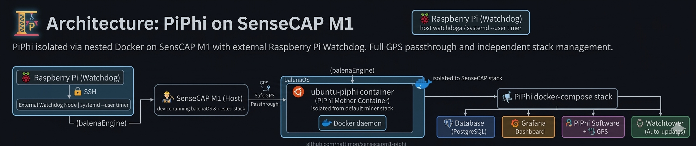

# 🛰️ PiPhi on SenseCAP M1 (balenaOS)




Run the **PiPhi network stack** on a **SenseCAP M1** device using **balenaOS** and a **USB GPS module**.

This repository provides a helper script that prepares a **safe PiPhi environment inside a container**, preventing the main SenseCAP services from being overloaded.

The installation script prepares the environment and automatically modifies `docker-compose.yml` (GPS configuration, devices, volumes).

**Important:**  
The script **does not automatically start PiPhi services**.  
PiPhi containers are started manually using `docker compose`.

## ⚡ Automatic Startup of the PiPhi Panel

To enable fully automatic startup of the **PiPhi** panel, you need to install the **Watchdog** ⏱️.  
The Watchdog should be installed on another local or remote device 💻 with SSH access 🔑 to the **SenseCap** device.  
Once the Watchdog is configured correctly, the PiPhi service will start automatically 🚀 without any manual intervention.  

📌 Installation instructions for the Watchdog are available in the dedicated repository: [PiPhi Watchdog](https://github.com/hattimon/sensecapm1-piphi/tree/main/piphi-watchdog)

---

# 🌐 Language / Język

* 🇬🇧 [English Documentation](#-english-documentation)
* 🇵🇱 [Dokumentacja po Polsku](#-dokumentacja-po-polsku)

---

# 🏗 Architecture

The environment runs PiPhi **inside a nested Docker environment** to isolate it from the default SenseCAP miner stack.

```
SenseCAP M1
      │
      ▼
  balenaEngine
      │
      ▼
 ubuntu-piphi container
      │
      ▼
   Docker daemon
      │
      ▼
 PiPhi docker-compose stack
      │
 ┌───────────────┬───────────────┬───────────────┐
 ▼               ▼               ▼
Database       Grafana        PiPhi Software
(PostgreSQL)   Dashboard      + GPS
```

This approach ensures:

- SenseCAP base system remains stable
- PiPhi runs in an isolated environment
- GPS can be passed safely into the container
- Docker services can be restarted independently

---

# 🇬🇧 English Documentation

## 📑 Table of Contents

* ⚙️ Requirements
* 🔐 SSH Root Access
* 🚀 Quick Installation
* 📁 Manual Installation
* 🐳 Starting PiPhi
* 🌍 Accessing Interfaces
* 📡 GPS Support
* 🛠 Troubleshooting

---

# ⚙️ Requirements

Before installation make sure you have:

* **SenseCAP M1**
* **balenaOS**
* **root SSH access**
* **USB GPS module** (recommended U-Blox 7)
* Internet connection

---

# 🔐 SSH Root Access to SenseCAP M1

Before installing PiPhi you must have **root SSH access**.

Full guide:

https://github.com/hattimon/miner_watchdog/blob/main/linki.md#jak-dosta%C4%87-si%C4%99-na-root-sensecap-m1-przez-ssh

The guide explains how to:

- enable SSH
- connect to SenseCAP
- obtain root shell
- manage the device via terminal

---

Verify GPS device:

```
ls /dev/ttyACM*
```

Expected:

```
/dev/ttyACM0
```

---

# 🚀 Quick Installation

```
mkdir -p /mnt/data/piphi
cd /mnt/data/piphi

wget https://raw.githubusercontent.com/hattimon/sensecapm1-piphi/main/install-piphi-sensecapm1.sh -O install-piphi-sensecapm1.sh
chmod +x install-piphi-sensecapm1.sh

./install-piphi-sensecapm1.sh
```

Select:

```
1 - Prepare / reinstall PiPhi
```

---

# 📁 Manual Installation

```
mkdir -p /mnt/data/piphi
cd /mnt/data/piphi
```

Download installer:

```
wget https://raw.githubusercontent.com/hattimon/sensecapm1-piphi/main/install-piphi-sensecapm1.sh
chmod +x install-piphi-sensecapm1.sh
```

Run installer:

```
./install-piphi-sensecapm1.sh
```

The script automatically:

* checks `/dev/ttyACM0`
* downloads PiPhi docker-compose
* injects GPS configuration
* fixes volumes
* creates `/mnt/data/piphi`
* pulls `ubuntu:20.04`
* creates container `ubuntu-piphi`
* installs Docker + Docker Compose
* creates helper script `/piphi-network/start-piphi.sh`

Helper script purpose:

```
/piphi-network/start-piphi.sh
```

This script **only starts dockerd inside the container**.  
PiPhi services are started manually using `docker compose`.

---

Verify container:

```
balena ps
```

Expected:

```
ubuntu-piphi (Up)
```

---

# 🐳 Starting PiPhi

Enter container:

```
balena exec -it ubuntu-piphi bash
cd /piphi-network
```

Start Docker daemon:

```
dockerd --host=unix:///var/run/docker.sock > /piphi-network/dockerd.log 2>&1 &
sleep 10
docker ps
```

---

## Stage 1 — Database + Grafana

```
docker compose -f docker-compose.yml up -d db grafana
sleep 20
docker ps
```

---

## Stage 2 — PiPhi + Watchtower

```
docker compose -f docker-compose.yml up -d software watchtower
```

---

# 🌍 Accessing Interfaces

PiPhi dashboard:

```
http://YOUR_SENSECAP_IP:31415
```

Grafana dashboard:

```
http://YOUR_SENSECAP_IP:3000
```

---

# 📡 GPS Support

PiPhi reads GPS from:

```
/dev/ttyACM0
```

Optional test:

```
docker stop piphi-network-image

gpsd -N -n /dev/ttyACM0 -F /var/run/gpsd.sock &
cgps -s
```

Restart PiPhi:

```
pkill gpsd
docker start piphi-network-image
```

---

# 🛠 Troubleshooting

## balenaEngine resets docker socket

Sometimes Docker inside the container stops responding.

Fix:

```
cd /piphi-network

dockerd --host=unix:///var/run/docker.sock > /piphi-network/dockerd.log 2>&1 &
sleep 10

docker compose -f docker-compose.yml up -d db grafana
docker compose -f docker-compose.yml up -d software watchtower
```

---

## GPS not detected

Check:

```
ls /dev/ttyACM*
```

Reconnect GPS or reboot device.

---

## Containers not starting

Check logs:

```
docker compose logs
```

or

```
docker logs piphi-network-image
```

---

# 🧭 Basic Navigation

## Enter the Ubuntu container on Balena:

```
balena exec -it ubuntu-piphi bash
```

### Check containers
```
docker ps
```

## Exit the Ubuntu container back to Balena
```
exit
```

### Check containers
```
balena ps
```
---


# 🇵🇱 Dokumentacja po Polsku

## 📑 Spis treści

* Wymagania
* Dostęp SSH root
* Szybka instalacja
* Instalacja ręczna
* Uruchomienie PiPhi
* Dostęp do paneli
* GPS
* Rozwiązywanie problemów

---

# ⚙️ Wymagania

Przed instalacją potrzebujesz:

* **SenseCAP M1**
* **balenaOS**
* **dostęp root SSH**
* **GPS USB**
* Internet

---

# 🔐 Dostęp root SSH do SenseCAP M1

Instrukcja:

https://github.com/hattimon/miner_watchdog/blob/main/linki.md#jak-dosta%C4%87-si%C4%99-na-root-sensecap-m1-przez-ssh

Pokazuje jak:

- włączyć SSH
- połączyć się z urządzeniem
- uzyskać dostęp root

---

Sprawdzenie GPS:

```
ls /dev/ttyACM*
```

Powinno być:

```
/dev/ttyACM0
```

---

# 🚀 Szybka instalacja

```
mkdir -p /mnt/data/piphi
cd /mnt/data/piphi

wget https://raw.githubusercontent.com/hattimon/sensecapm1-piphi/main/install-piphi-sensecapm1.sh
chmod +x install-piphi-sensecapm1.sh

./install-piphi-sensecapm1.sh
```

---

# 📁 Instalacja ręczna

```
mkdir -p /mnt/data/piphi
cd /mnt/data/piphi
```

Pobierz instalator:

```
wget https://raw.githubusercontent.com/hattimon/sensecapm1-piphi/main/install-piphi-sensecapm1.sh
```

Uruchom:

```
./install-piphi-sensecapm1.sh
```

Skrypt:

- przygotuje środowisko
- zmodyfikuje docker-compose
- doda GPS
- utworzy kontener `ubuntu-piphi`
- utworzy helper `/piphi-network/start-piphi.sh`

Skrypt **nie uruchamia usług PiPhi automatycznie**.

## ⚡ Automatyczny Start Panelu PiPhi

Aby uruchomić panel **PiPhi** całkowicie automatycznie, należy zainstalować **Watchdoga** ⏱️.  
Watchdog powinien być zainstalowany na innym lokalnym lub zdalnym urządzeniu 💻, które posiada dostęp SSH 🔑 do urządzenia **SenseCapa**.  
Po poprawnej konfiguracji Watchdoga, serwis PiPhi będzie startować automatycznie 🚀 bez potrzeby ręcznej interwencji.  

📌 Instrukcje instalacji Watchdoga znajdują się w dedykowanym repozytorium: [PiPhi Watchdog](https://github.com/hattimon/sensecapm1-piphi/tree/main/piphi-watchdog)

---

# 🐳 Uruchomienie PiPhi

```
balena exec -it ubuntu-piphi bash
cd /piphi-network
```

Start dockera:

```
dockerd --host=unix:///var/run/docker.sock > dockerd.log 2>&1 &
sleep 10
```

---

## Etap 1

```
docker compose up -d db grafana
```

---

## Etap 2

```
docker compose up -d software watchtower
```

---

# 🌍 Dostęp

Panel PiPhi

```
http://IP_TWOJEGO_SENSECAP:31415
```

Grafana

```
http://IP_TWOJEGO_SENSECAP:3000
```

---

# 📡 GPS

GPS działa przez:

```
/dev/ttyACM0
```

---

# 🛠 Rozwiązywanie problemów

### Reset docker socket

```
cd /piphi-network

dockerd --host=unix:///var/run/docker.sock > dockerd.log 2>&1 &
sleep 10

docker compose up -d db grafana
docker compose up -d software watchtower
```

---

### Brak GPS

Sprawdź:

```
ls /dev/ttyACM*
```

---

### Kontenery nie startują

```
docker compose logs
```

lub

```
docker logs piphi-network-image
```
---

# 🧭 Podstawowe poruszanie

## Wejdź do kontenera ubuntu na balena:

```
balena exec -it ubuntu-piphi bash
```

### Sprawdź kontenery
```
docker ps
```

## Wyjdź z kontenera ubuntu do balena    
```
exit
```

### Sprawdź kontenery
```
balena ps
```
---
