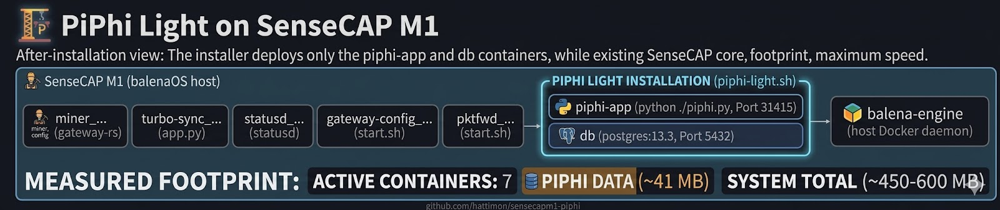
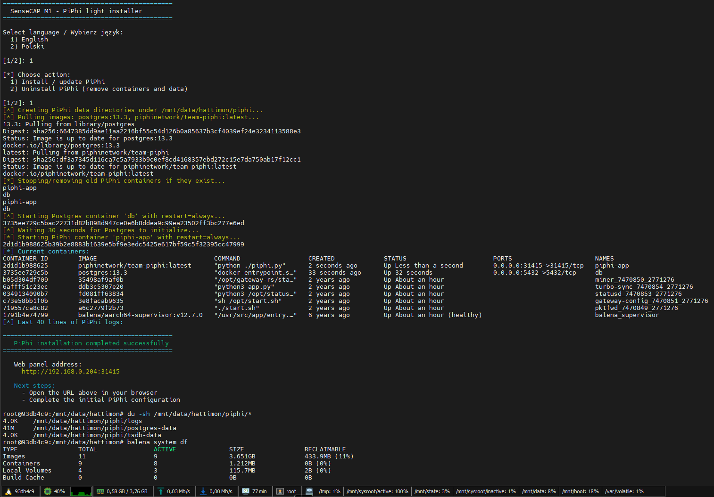
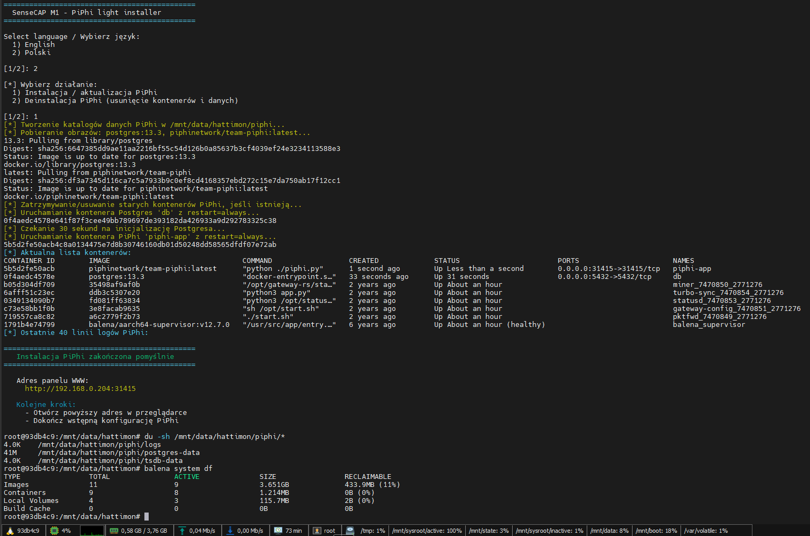

# 🌐 PiPhi Light Installer (SenseCAP M1)

> 🚀 Lightweight PiPhi deployment for SenseCAP M1 with minimal disk
> usage



------------------------------------------------------------------------

## 🌍 Language / Język

-   🇬🇧 [English](#english)
-   🇵🇱 [Polski](#polish)

------------------------------------------------------------------------
<a id="english"></a>
## 🇬🇧 English -- PiPhi Light installer (SenseCAP M1)

### ⚡ Overview

This **light installer** allows quick deployment of **PiPhi** on a
**SenseCAP M1** device while keeping disk usage as small as possible.

The goal of this project is:

-   ⚡ **Fast installation**
-   💾 **Minimal disk footprint**
-   🔧 **Simple maintenance**
-   📦 **Clean container setup**

The installer automatically prepares the directory structure, downloads
required images, and starts the containers.

------------------------------------------------------------------------

### 🚀 Installation

Run the following commands directly on your **SenseCAP M1** device:

``` bash
mkdir -p /mnt/data/hattimon
cd /mnt/data/hattimon

curl -L https://raw.githubusercontent.com/hattimon/sensecapm1-piphi/main/piphi-light/sensecapm1-piphi-light.sh -o sensecapm1-piphi-light.sh
chmod +x sensecapm1-piphi-light.sh
./sensecapm1-piphi-light.sh
```

The installer will:

1.  Create the required directory structure
2.  Pull the required Docker images
3.  Start PiPhi services
4.  Initialize PostgreSQL storage

------------------------------------------------------------------------

### 🖥️ Example installation output

Example output during installation:



------------------------------------------------------------------------

### 📊 Real disk usage (measured)

Measured on a **real SenseCAP M1 installation**.

Commands used for verification:

``` bash
du -sh /mnt/data/hattimon/piphi/*
balena system df
```

#### 📁 Runtime data

    postgres-data   ~41 MB
    logs            ~4 KB
    tsdb-data       ~4 KB

👉 **Total runtime data: \~41 MB**

These directories contain:

-   **postgres-data** → database storage
-   **tsdb-data** → time-series metrics storage
-   **logs** → application logs

------------------------------------------------------------------------

### 💾 Real installation footprint

  Component            Disk usage
  -------------------- ---------------
  📁 Runtime data      \~41 MB
  📦 Docker images     \~400--550 MB
  ⚙️ Total footprint   \~450--600 MB

👉 PiPhi installation adds **only two Docker images**:

-   PiPhi container
-   PostgreSQL container

------------------------------------------------------------------------

### 📦 Docker image changes

Before installation:

    ACTIVE images: 7

After installation:

    ACTIVE images: 9

👉 **+2 images added by PiPhi installer**

------------------------------------------------------------------------

### 🧹 After uninstall

When PiPhi is removed:

-   runtime data removed ✅
-   containers removed ✅
-   Docker images may remain cached ❗

Example system state:

    ACTIVE: 7
    RECLAIMABLE: 2.7 GB

This means the images are **no longer used but still cached** by the
container engine.

------------------------------------------------------------------------

### ⚠️ Important note about balenaEngine

SenseCAP devices use **balenaEngine**, which behaves slightly
differently than standard Docker.

Important behavior:

-   Images may remain **cached**
-   `balena image prune -f` may **not remove them immediately**
-   Images may be marked as **reclaimable but still stored**

This happens because:

-   images may be **system-managed**
-   layers may be **shared with other containers**

👉 This is **normal behavior on SenseCAP systems**.

## Support My Work
If you find this script helpful, consider supporting the project:    
[](https://ko-fi.com/B0B01KMW5G)

------------------------------------------------------------------------
<a id="polish"></a>
## 🇵🇱 Polski -- Instalator PiPhi Light (SenseCAP M1)

### ⚡ Opis

Lekka wersja instalatora umożliwia szybkie wdrożenie **PiPhi na
urządzeniu SenseCAP M1** przy **minimalnym zużyciu miejsca na dysku**.

Główne cele projektu:

-   ⚡ **szybka instalacja**
-   💾 **minimalny footprint**
-   🔧 **prosta obsługa**
-   📦 **czyste środowisko kontenerów**

Instalator automatycznie:

1.  przygotowuje strukturę katalogów
2.  pobiera wymagane obrazy Docker
3.  uruchamia kontenery
4.  inicjalizuje bazę PostgreSQL

------------------------------------------------------------------------

### 🚀 Instalacja

Wykonaj poniższe polecenia na urządzeniu **SenseCAP M1**:

``` bash
mkdir -p /mnt/data/hattimon
cd /mnt/data/hattimon

curl -L https://raw.githubusercontent.com/hattimon/sensecapm1-piphi/main/piphi-light/sensecapm1-piphi-light.sh -o sensecapm1-piphi-light.sh
chmod +x sensecapm1-piphi-light.sh
./sensecapm1-piphi-light.sh
```

------------------------------------------------------------------------

### 🖥️ Przykładowy wynik instalacji

Przykładowy wynik instalacji:



------------------------------------------------------------------------

### 📊 Rzeczywiste zużycie miejsca (pomiar)

Pomiar wykonany na **rzeczywistej instalacji SenseCAP M1**.

Polecenia użyte do pomiaru:

``` bash
du -sh /mnt/data/hattimon/piphi/*
balena system df
```

#### 📁 Dane aplikacji

    postgres-data   ~41 MB
    logs            ~4 KB
    tsdb-data       ~4 KB

👉 **Łączne dane runtime: \~41 MB**

Katalogi zawierają:

-   **postgres-data** → baza danych
-   **tsdb-data** → dane metryk
-   **logs** → logi aplikacji

------------------------------------------------------------------------

### 💾 Faktyczny footprint instalacji

  Element             Zużycie
  ------------------- ---------------
  📁 Dane aplikacji   \~41 MB
  📦 Obrazy Docker    \~400--550 MB
  ⚙️ Razem            \~450--600 MB

Instalacja dodaje tylko **2 obrazy Docker**:

-   kontener PiPhi
-   kontener PostgreSQL

------------------------------------------------------------------------

### 🧹 Po odinstalowaniu

Po usunięciu PiPhi:

-   dane aplikacji usunięte ✅
-   kontenery usunięte ✅
-   obrazy Docker mogą pozostać w cache ❗

Przykład:

    ACTIVE: 7
    RECLAIMABLE: 2.7 GB

------------------------------------------------------------------------

### ⚠️ Uwaga dotycząca balenaEngine

Na urządzeniach SenseCAP używany jest **balenaEngine**.

W praktyce oznacza to:

-   obrazy Docker mogą pozostać **w cache**
-   `balena image prune -f` **nie zawsze usuwa je od razu**
-   obrazy mogą być współdzielone z innymi warstwami systemu

👉 Jest to **normalne zachowanie systemu**.

## Wspieraj Moją Pracę
Jeśli uważasz, że ten skrypt jest pomocny, rozważ wsparcie projektu:    
[](https://ko-fi.com/B0B01KMW5G)
