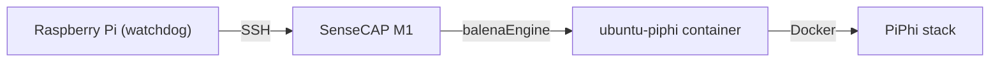

# 🛰️ PiPhi Watchdog for SenseCAP M1


Automatic **recovery watchdog for PiPhi running on SenseCAP M1**.

The watchdog runs on a **Raspberry Pi** and automatically restores the **PiPhi panel and containers** if the system becomes unavailable due to:

- power outages
- device reboot
- container crashes
- network failures

The system uses **safe recovery logic with exponential backoff** to prevent unnecessary hardware stress.

---

# 🌐 Language / Język

- 🇬🇧 [English Documentation](#english-documentation)
- 🇵🇱 [Dokumentacja po Polsku](#dokumentacja-po-polsku)

---

# ✨ Features

⚡ **Automatic panel monitoring**  
Periodically checks the PiPhi web interface.

🔐 **Secure SSH recovery**  
Uses SSH key authentication to connect to SenseCAP.

🐳 **Container recovery logic**  
Restarts services inside the `ubuntu-piphi` container.

🧠 **Smart exponential backoff**  
Prevents aggressive restart loops.

🔁 **Automatic gateway reboot fallback**  
If recovery fails repeatedly, the gateway can be rebooted.

🕒 **Systemd timer automation**  
Runs automatically every 10 minutes.

🧩 **Installer-generated watchdog script**  
The installer generates a **local watchdog script tailored to your system**.

⏸ **Maintenance mode**  
Allows temporarily stopping the watchdog during installations or debugging.

---

# 🏗 Architecture



- **Raspberry Pi** – host for the watchdog and `systemd --user` timer / host watchdoga i `systemd --user` timer  
- **SenseCAP M1** – device running balenaOS and PiPhi in a container / urządzenie z balenaOS i PiPhi w kontenerze  
- **ubuntu-piphi** – container prepared by the installer script / kontener przygotowany przez skrypt instalacyjny  
- **PiPhi stack** – database, Grafana, PiPhi app, Watchtower / baza danych, Grafana, aplikacja PiPhi, Watchtower  

---

<a id="english-documentation"></a>
# 🇬🇧 English Documentation

## 📦 Repository Files

| File | Description |
|-----|-------------|
| `piphi-watchdog-setup.sh` | Interactive installer |
| `piphi-watchdog.sh` | Example watchdog script |

⚠️ **Important**

The installer **does NOT download the watchdog script from GitHub**.

Instead it **generates a local script**:

```
$HOME/piphi-watchdog.sh
```

This ensures the watchdog always matches the local configuration.

---

# ⚙️ Requirements

Before installation you need:

- Raspberry Pi running a **Debian-based OS**
  - Raspberry Pi OS
  - Ubuntu
- SSH key access to SenseCAP

```
user: sensecap_root
port: 22222
```

- Passphrase for the SSH key (if encrypted)

---

# 🚀 Installation

Clone repository:

```bash
git clone https://github.com/hattimon/sensecapm1-piphi.git
cd sensecapm1-piphi/piphi-watchdog
```

Run installer:

```bash
chmod +x piphi-watchdog-setup.sh
./piphi-watchdog-setup.sh
```

---

# 🔧 What the Installer Does

The installer automatically:

1. Configures **ssh-agent as a user-level systemd service**
2. Adds your **SenseCAP SSH key to the agent**
3. Generates the watchdog script:

```
~/piphi-watchdog.sh
```

4. Creates systemd services:

```
piphi-watchdog.service
piphi-watchdog.timer
```

5. Enables automatic execution every:

```
10 minutes
```

---

# 🔁 Recovery Logic

The watchdog uses a multi-stage recovery process.

### Stage 1 — Panel Check

The script performs an HTTP request to the PiPhi panel.

If reachable → **no action required**

---

### Stage 2 — Container Recovery

If the panel is down the watchdog connects via SSH and verifies services inside:

```
ubuntu-piphi
```

Recovery may include:

```
dockerd restart
container restart
start-piphi.sh execution
```

---

### Stage 3 — Exponential Backoff

Retry intervals increase:

```
10 → 20 → 40 → 80 → 160 → 240 minutes
```

---

### Stage 4 — Gateway Reboot

If recovery fails after ~4 hours:

```
reboot
```

is executed on the SenseCAP gateway.

---

### Stage 5 — Long Recovery Cycle

Further attempts occur at:

```
8h → 16h → 24h
```

When the panel becomes reachable again:

```
All counters reset
```

---

# 🛠 Troubleshooting

### View watchdog logs

```
tail -f ~/piphi-watchdog-run.log
```

---

### Check watchdog status

```
systemctl --user status piphi-watchdog.service
```

---

### Check timer

```
systemctl --user status piphi-watchdog.timer
```

Expected output:

```
Active: active (waiting)
Triggers: piphi-watchdog.service
```

---

### Stop watchdog (maintenance)

During PiPhi installation or debugging:

```
systemctl --user stop piphi-watchdog.timer
systemctl --user stop piphi-watchdog.service
```

---

### Start watchdog again

```
systemctl --user start piphi-watchdog.timer
```

---

### Restart watchdog

```
systemctl --user restart piphi-watchdog.service
```

---

### Run watchdog manually

```
~/piphi-watchdog.sh
```

---

### Verify SSH authentication

```
export SSH_AUTH_SOCK="/run/user/$UID/ssh-agent.socket"
ssh-add ~/.ssh/sensecap_root
```

Test connection:

```
ssh -p 22222 sensecap_root@SENSECAP_IP
```

---

### Check container on SenseCAP

```
balena ps
```

Look for:

```
ubuntu-piphi
```

---

### Check PiPhi panel

```
curl http://SENSECAP_IP
```

---

### Reset watchdog state

```
rm ~/.piphi-watchdog-state
```

---

# 🔐 Security

The watchdog follows several security principles:

- SSH key authentication only
- No stored passwords
- Local configuration
- Minimal network exposure
- Runs under **user-level systemd**

---

<a id="dokumentacja-po-polsku"></a>
# 🇵🇱 Dokumentacja po Polsku

## 📦 Pliki w repozytorium

| Plik | Opis |
|-----|------|
| `piphi-watchdog-setup.sh` | Instalator interaktywny |
| `piphi-watchdog.sh` | Przykładowy skrypt watchdoga |

⚠️ **Ważne**

Instalator **nie pobiera skryptu z GitHuba**.

Generuje lokalny plik:

```
$HOME/piphi-watchdog.sh
```

---

## ⚙️ Wymagania

- Raspberry Pi z systemem Debian-based  
- dostęp SSH do SenseCAP

```
użytkownik: sensecap_root
port: 22222
```

---

## 🚀 Instalacja

```
git clone https://github.com/hattimon/sensecapm1-piphi.git
cd sensecapm1-piphi/piphi-watchdog
chmod +x piphi-watchdog-setup.sh
./piphi-watchdog-setup.sh
```

---

## 🔧 Co robi instalator

Instalator:

1. Konfiguruje **ssh-agent jako usługę systemd użytkownika**
2. Dodaje klucz SSH do agenta
3. Generuje watchdog

```
~/piphi-watchdog.sh
```

4. Tworzy

```
piphi-watchdog.service
piphi-watchdog.timer
```

5. Uruchamia watchdog **co 10 minut**

---

## 🔁 Logika naprawy

1. Sprawdzenie panelu PiPhi  
2. Restart usług w `ubuntu-piphi`  

Backoff:

```
10 → 20 → 40 → 80 → 160 → 240 minut
```

Po ~4 godzinach wykonywany jest:

```
reboot
```

Kolejne próby:

```
8h → 16h → 24h
```

Po powrocie panelu **liczniki resetują się**.

---

# 🛠 Rozwiązywanie problemów

### Podgląd logów

```
tail -f ~/piphi-watchdog-run.log
```

---

### Status usługi

```
systemctl --user status piphi-watchdog.service
```

---

### Status timera

```
systemctl --user status piphi-watchdog.timer
```

---

### Zatrzymanie watchdoga (maintenance)

```
systemctl --user stop piphi-watchdog.timer
systemctl --user stop piphi-watchdog.service
```

---

### Ponowne uruchomienie

```
systemctl --user start piphi-watchdog.timer
```

---

### Restart usługi

```
systemctl --user restart piphi-watchdog.service
```

---

### Ręczne uruchomienie

```
~/piphi-watchdog.sh
```

---

### Sprawdzenie SSH

```
export SSH_AUTH_SOCK="/run/user/$UID/ssh-agent.socket"
ssh-add ~/.ssh/sensecap_root
```

---

### Sprawdzenie kontenera

```
balena ps
```

---

### Sprawdzenie panelu

```
curl http://IP_SENSECAP
```

---

### Reset stanu watchdoga

```
rm ~/.piphi-watchdog-state
```

---

# ⭐ Contributing

Pull requests are welcome.

- open an **Issue**
- submit a **Pull Request**

---

# 📄 License

Released under **MIT License**

See:

```
LICENSE
```
