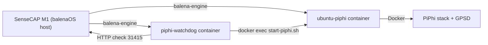

# 🛰️ PiPhi Watchdog for SenseCAP M1 (balenaOS)


Automatic **recovery watchdog for PiPhi running directly on SenseCAP M1 (balenaOS)**.

The watchdog runs as a **balenaOS container on the SenseCAP host** and automatically restores the **PiPhi panel and containers** if the system becomes unavailable due to:

- power outages
- device reboot
- container crashes
- docker daemon issues inside `ubuntu-piphi`

The system uses **safe recovery logic with backoff** to avoid unnecessary restart loops and to give **GPS time to reacquire a fix**.

---

# 🌐 Language / Język

- 🇬🇧 [English Documentation](#english-documentation)
- 🇵🇱 [Dokumentacja po Polsku](#dokumentacja-po-polsku)

---

# ✨ Features

⚡ **Automatic PiPhi panel monitoring**  
Periodically checks the PiPhi web UI on the SenseCAP host (`http://127.0.0.1:31415/`).

🐳 **Host-level watchdog container**  
Runs as a container on balenaOS and talks to `balena-engine` via the Docker socket.

🧩 **Installer-generated watchdog script**  
The installer builds a **small Alpine image with a generated `watchdog.sh`**, tailored to your configuration.

🧠 **Smart recovery logic with backoff**  
Avoids tight restart loops and gives the system time to boot PiPhi and GPS.

🛰 **Integrated GPS startup**  
Relies on `start-piphi.sh` inside `ubuntu-piphi` to start **dockerd + PiPhi stack + GPSD**.

🔁 **Automatic recovery after reboot**  
The watchdog container is created with `--restart unless-stopped`, so it is started automatically by balenaOS.

---

# 🏗 Architecture



- **SenseCAP M1** – runs **balenaOS** and multiple containers (`ubuntu-piphi`, miner, etc.).
- **piphi-watchdog** – small Alpine container with `docker-cli` and `watchdog.sh`, monitoring the PiPhi panel.
- **ubuntu-piphi** – Ubuntu container prepared by your PiPhi installer script.
- **PiPhi stack + GPSD** – database, Grafana, PiPhi app, Watchtower and GPS daemon, started via `start-piphi.sh`.

---

<a id="english-documentation"></a>
# 🇬🇧 English Documentation

## 📦 Repository Files (watchdog for balenaOS)

In this repository:

| File | Description |
|------|-------------|
| `piphi-watchdog/install-piphi-watchdog-balena.sh` | Interactive installer, builds and runs the watchdog container on balenaOS |
| `piphi-watchdog/` | Directory for watchdog-related files |

> The installer **does NOT download `watchdog.sh` from GitHub** at runtime.  
> Instead it **generates `watchdog.sh` locally** and builds a small image around it.

---

## ⚙️ Requirements

Before installation on SenseCAP M1 you need:

- SenseCAP M1 running **balenaOS** with:
  - `balena` CLI available on the host shell,
  - `ubuntu-piphi` container installed and **prepared with PiPhi + `start-piphi.sh`**.
- A working PiPhi installation reachable on the host as:

```
http://127.0.0.1:31415/
```

- Access to the **host shell** of the SenseCAP M1 (via SSH or console).

---

## 🚀 Installation (balenaOS Watchdog)

1. **Log in to the SenseCAP M1 host shell** (balenaOS).

2. **Clone repository or upload script to the device**

```bash
git clone https://github.com/hattimon/sensecapm1-piphi.git
cd sensecapm1-piphi/piphi-watchdog
```

Copy `install-piphi-watchdog-balena.sh` to the SenseCAP host, or mount the repository there.

3. **Run the installer on the SenseCAP host**

```bash
chmod +x install-piphi-watchdog-balena.sh
./install-piphi-watchdog-balena.sh
```

4. **Language selection**

The installer will ask:

```
Select language / Wybierz język:
1) English (default)
2) Polski
```

- Press `Enter` for **English**
- Enter `2` for **Polish**

The selected language controls:

- Installer messages
- Watchdog logs (`balena logs -f piphi-watchdog`)

---

## 🔧 What the Installer Does

The balenaOS watchdog installer:

1. Creates install directory on the SenseCAP host:

```
/mnt/data/piphi-watchdog-balena
```

2. Generates `watchdog.sh` with:

- HTTP checks on `127.0.0.1:31415`
- Initial **boot delay** (default 600 s, 10 minutes)
- 60 s interval between checks
- Recovery logic using `start-piphi.sh` inside `ubuntu-piphi`
- English or Polish log messages (based on your choice)

3. Builds a small Alpine image:

```
piphi-watchdog-balena:latest
```

4. Removes any previous watchdog container named:

```
piphi-watchdog
```

5. Starts a new watchdog container:

```bash
balena run -d \
  --name piphi-watchdog \
  --restart unless-stopped \
  --net host \
  -e PIPHI_PORT="31415" \
  -e CHECK_INTERVAL="60" \
  -e BOOT_DELAY="600" \
  -e UBUNTU_PIPHI_NAME="ubuntu-piphi" \
  -e LANGUAGE="en|pl" \
  -v /run/balena-engine.sock:/var/run/docker.sock \
  -e DOCKER_HOST="unix:///var/run/docker.sock" \
  piphi-watchdog-balena:latest
```

---

## 🔁 Recovery Logic

### Stage 0 — Initial Warmup (BOOT_DELAY)

After SenseCAP host boot or watchdog container start:

- watchdog **waits `BOOT_DELAY` seconds** (default 600 s = 10 minutes)
- this gives time for:
  - `ubuntu-piphi` container to start,
  - Docker daemon inside `ubuntu-piphi` to come up,
  - PiPhi stack and database to initialize,
  - GPSD to get a fix.

During this warmup there are **no health checks** and no recovery actions.

---

### Stage 1 — Panel Check (every 60s)

Every `CHECK_INTERVAL` seconds (default 60):

- watchdog runs an HTTP check:

```bash
curl -s --max-time 5 http://127.0.0.1:31415/
```

- If the panel is reachable → **no action**
- If the panel is down → go to Stage 2.

---

### Stage 2 — Failure Counting and Container Check

When the panel is down:

1. Watchdog logs the failure.
2. Runs `docker ps` on the host (diagnostics).
3. Verifies if `ubuntu-piphi` container is running:
   - If not running → tries to `docker restart ubuntu-piphi`.
4. Increments `consecutive_failures` counter.

- If `consecutive_failures < 3` → just logs and waits for the next 60 s check.
- If `consecutive_failures >= 3` → goes to Stage 3.

---

### Stage 3 — Full Recovery via `start-piphi.sh`

When the threshold is reached:

```bash
docker exec ubuntu-piphi sh -lc 'cd /piphi-network && ./start-piphi.sh'
```

Then watchdog:

- waits **POST_RESTART_DELAY (300 s)**  
- rechecks the panel

If panel is back → reset failure counter.

---

## 📋 Logs and Monitoring

### Watchdog logs

```bash
balena logs -f piphi-watchdog
```

---

### List containers

```bash
balena ps
```

To see PiPhi containers inside `ubuntu-piphi`:

```bash
balena exec -it ubuntu-piphi docker ps
```

---

<a id="dokumentacja-po-polsku"></a>
# 🇵🇱 Dokumentacja po Polsku

## 📦 Pliki w repozytorium

| Plik | Opis |
|------|------|
| `piphi-watchdog/install-piphi-watchdog-balena.sh` | Instalator watchdoga na balenaOS |
| `piphi-watchdog/` | Katalog plików watchdoga |

---

## ⚙️ Wymagania

- SenseCAP M1 z **balenaOS**
- kontener **ubuntu-piphi**
- działający panel PiPhi:

```
http://127.0.0.1:31415/
```

---

## 🚀 Instalacja

```bash
git clone https://github.com/hattimon/sensecapm1-piphi.git
cd sensecapm1-piphi/piphi-watchdog
chmod +x install-piphi-watchdog-balena.sh
./install-piphi-watchdog-balena.sh
```

---

## 📋 Logi

```bash
balena logs -f piphi-watchdog
```

---

# ⭐ Contributing

Pull requests are welcome.

---

# 📄 License

MIT License

See:

```
LICENSE
```
